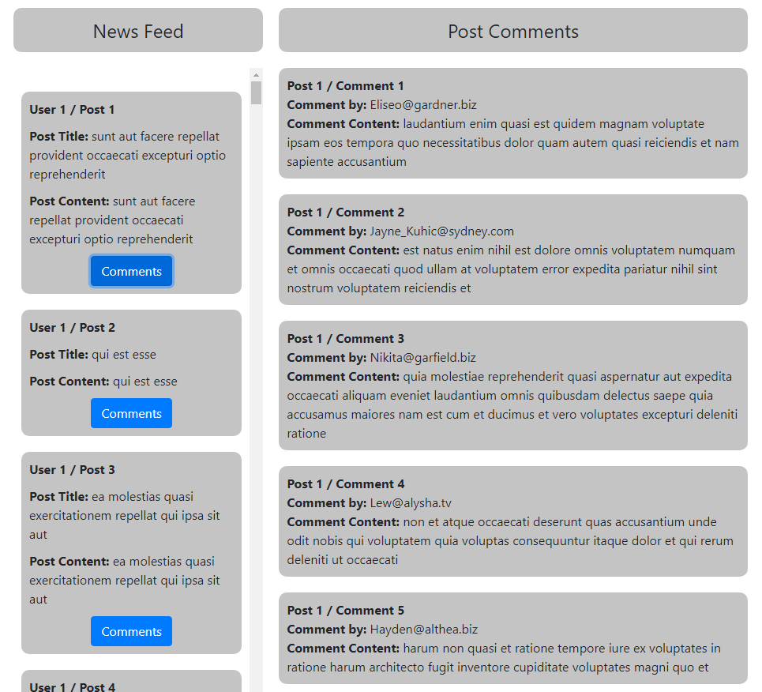

# News Feed React App

## API for all posts

[https://jsonplaceholder.typicode.com/posts](https://jsonplaceholder.typicode.com/posts)
In the project directory, you can run:

### API for comments related to the single post (/1/ has to be dynamic)

[https://jsonplaceholder.typicode.com/posts/1/comments](https://jsonplaceholder.typicode.com/posts/1/comments)

### Deployment

This React App has been deployed to:
Heroku - [https://news-post-react-app.herokuapp.com/](https://news-post-react-app.herokuapp.com/)
and Surge - [http://vengeful-balls.surge.sh/](http://vengeful-balls.surge.sh/)
